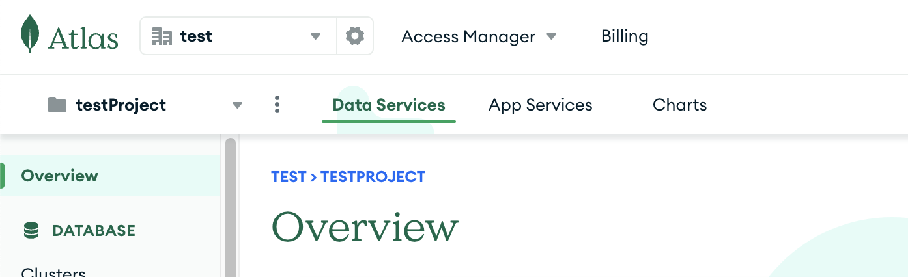
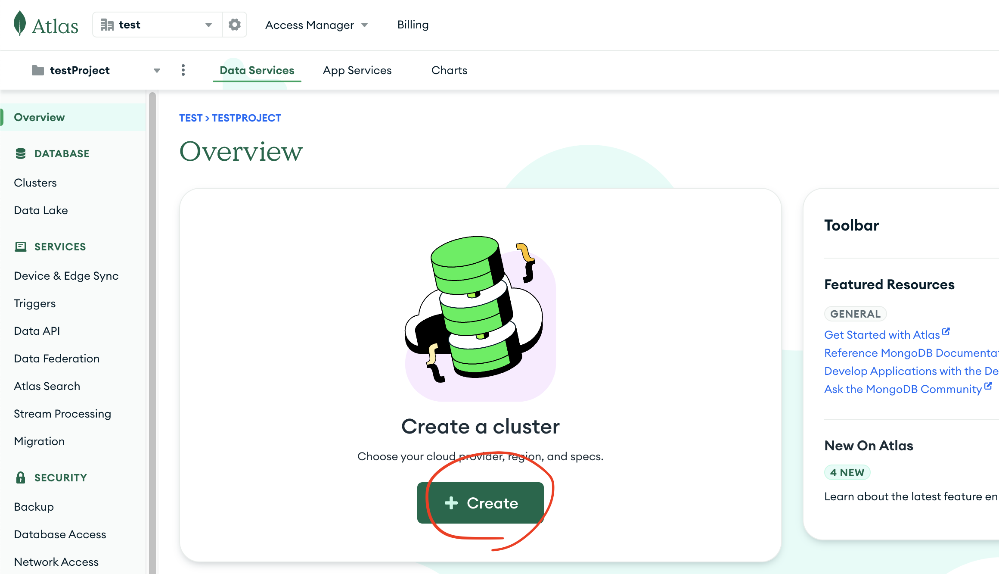
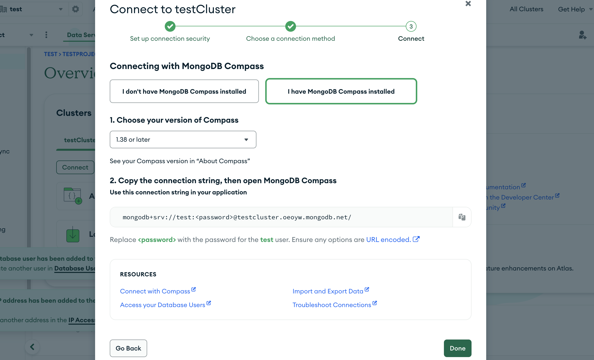

# 1. Altas 접속

https://www.mongodb.com/ko-kr/cloud/atlas/register

- 위 사이트에 접속해서 계정을 생성하여 등록해줍니다.

# 2. 프로젝트 생성



- 프로젝트를 생성해줍니다.

# 3. 클러스터 구성



- 아래 생성을 누른 후 스펙을 설정해줍니다.

# 4. Compass 연동



```bash
mongodb+srv://test:<password>@testcluster.oeoyw.mongodb.net/
```

- 링크를 복사해서 Compass 에 연결하면 됩니다.

# 5. 연동 정리 글

https://ssddo-story.tistory.com/46